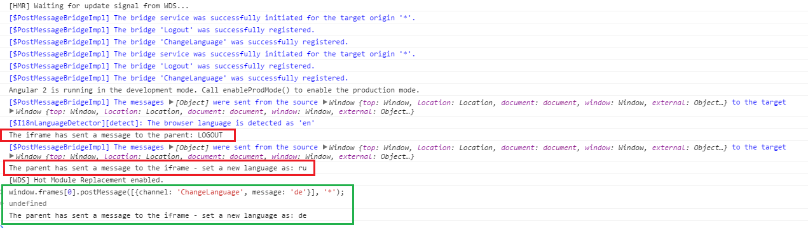

# angular2-post-message

An implementation of the cross-origin communication via postMessage at Angular2.

## Installation

First you need to install the npm module:
```sh
npm install angular2-post-message --save
```

## Use

**main.ts**
```typescript
import {PostMessageBridgeImpl} from 'angular2-post-message';

export function main() {
    return bootstrap(App, [
        PostMessageBridgeImpl,
        ...
    ]);
}
```

**app.ts**
```typescript
import {PostMessageBridgeImpl, IPostMessageBridge} from 'angular2-post-message';

@Component({
  selector: 'app',
  ...
})
export class App {

    constructor(@Inject(PostMessageBridgeImpl) protected postMessageBridge:IPostMessageBridge) {

        postMessageBridge
            .connect(window, window.top)
            .makeBridge('ChangeLanguage')
            .makeBridge('Logout')
            .addListener('ChangeLanguage', (message:any) => console.log('ChangeLanguage..., message:', message))
            .addListener('Logout', () => console.log('Logout...'))
            .sendMessage('ChangeLanguage', 'ru');

        setTimeout(() => postMessageBridge.sendMessage('Logout', null), 2000);
    }
}
```

## Demo

**Preview**


## License

Licensed under MIT.