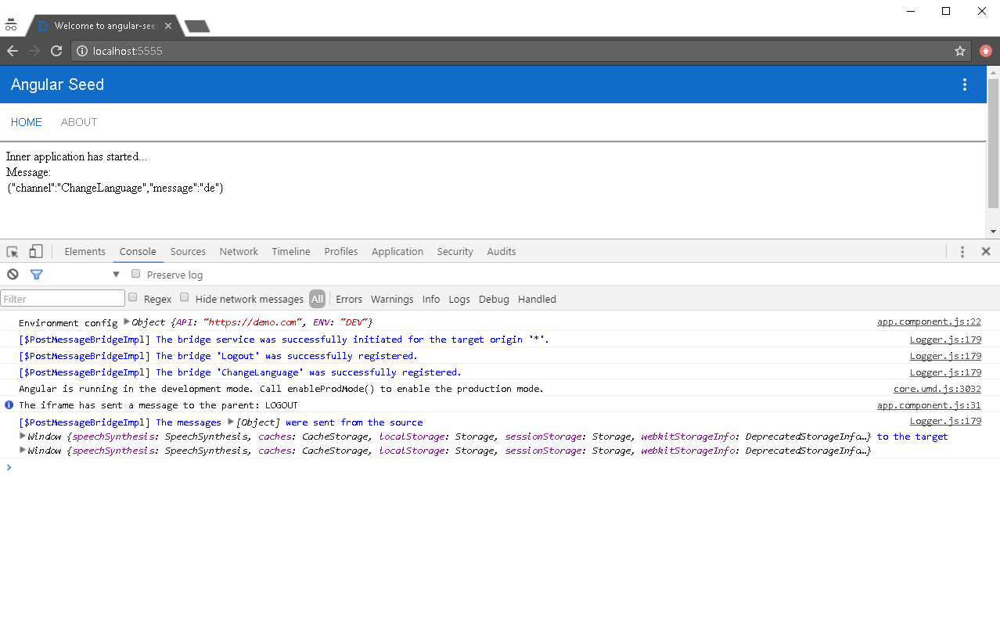

# ngx-post-message

An implementation of the cross-origin communication via postMessage at Angular2 [4.3.1 compatible].

## Description

The implementation is based on the PostMessageBusSource & PostMessageBusSink implementation of the @angular/platform-webworker package.
At the current implementation of the wrapper, a **bridge** term is **equivalent** the Angular2 **channel**.  

## Installation

First you need to install the npm module:
```sh
npm install ts-smart-logger --save

npm install ngx-post-message --save
```

## Demo

**1** git clone --progress -v "git@github.com:apoterenko/ngx-post-message.git" "D:\sources"
**2** cd D:\sources\ngx-post-message\demo
**3** npm install  
**4** npm start 

## Use

**main.ts**
```typescript
import {PostMessageModule} from 'ngx-post-message/index';

@NgModule({
    bootstrap: [ApplicationComponent],
    imports: [
        PostMessageModule,
        ...
    ],
    ...
})
export class ApplicationModule {
}
```

**AppRootPostMessageModule.ts - Root application module**
```typescript
@NgModule()
export class AppRootPostMessageModule {

	constructor(@Inject(PostMessageBridgeFactory) private bridgeFactory: PostMessageBridgeFactory) {
		/**
		 * Root context
		 */
		const iFrame: IPostMessageEventTarget = window.frames[0];
		const currentWindow: IPostMessageEventTarget = window;

		// The main usage scenario
		bridgeFactory.makeInstance()
			.setEnableLogging(false)            // By default, the smart logger is enabled
			.connect(currentWindow, iFrame)
			.makeBridge('Logout')
			.makeBridge('ChangeLanguage')
			.addListener('Logout', (message: any) => console.log('The iframe has sent a message to the parent: LOGOUT'))
			.sendMessage('ChangeLanguage', 'ru');

		// The additional usage scenario
		// You can also use the direct native mechanism of sending the message (if the external application does not use Angular2)
		window.frames[0].postMessage([{channel: 'ChangeLanguage', message: 'de'}], '*');
	}
}
```

**AppFramePostMessageModule.ts - IFrame application module.**
```typescript
@NgModule()
export class AppFramePostMessageModule {

	constructor(@Inject(PostMessageBridgeFactory) private bridgeFactory: PostMessageBridgeFactory) {
		/**
		 * IFrame context
		 */
		const iFrame: IPostMessageEventTarget = window;
		const parentWindow: IPostMessageEventTarget = window.top;

		// The main usage scenario
		bridgeFactory.makeInstance()
			.setEnableLogging(false)            // By default, the smart logger is enabled
			.connect(iFrame, parentWindow)
			.makeBridge('Logout')
			.makeBridge('ChangeLanguage')
			.addListener('ChangeLanguage', (message: any) => console.log(`The parent has sent a message to the iframe - set a new language as: ${message}`))
			.sendMessage('Logout');

		// The additional usage scenario
		// You can also use the direct native mechanism of sending the message (if the external application does not use Angular2)
		window.top.postMessage([{channel: 'Logout'}], '*');
	}
}
```

## Demo



## Publish

```sh
npm run deploy
```

## License

Licensed under MIT.